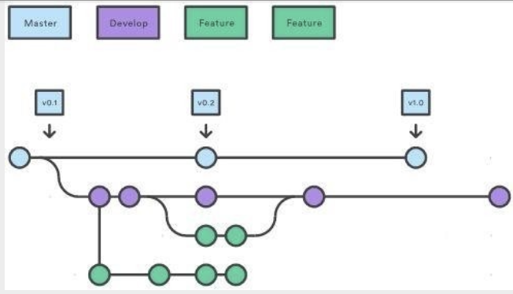

# QuickBytes 🍔

## Overview
Welcome to QuickBytes, the innovative solution designed to revolutionize how university students access food and drinks from on-campus establishments. Our application bridges the gap between convenience, community support, and safety by allowing students to place delivery orders without leaving their study spots.

## Objectives
- __Convenience__: With QuickBytes, students can order food and drinks from on-campus establishments without disrupting their study sessions or having to navigate crowded dining areas.

- __Community Engagement__: We aim to foster a sense of community by empowering students to support each other. Our platform creates opportunities for students to earn extra cash by fulfilling delivery requests for their peers.

- __Affordability__: By utilizing a peer-to-peer delivery model and operating within the campus vicinity, we ensure that delivery fees remain significantly lower compared to other services, making it accessible to students on tight budgets.

- __Safety__: By keeping delivery within the campus community, we reduce the presence of outsiders on campus, thereby enhancing overall safety for students and staff.

## How it works
1. __Order Placement__: Students simply browse through the app, select their desired items from on-campus eateries, and place their orders.

2. __Peer Delivery__: Other students who are willing to earn extra cash can sign up as delivery providers. When an order is placed, it gets assigned to an available delivery provider based on proximity and availability.

3. __Delivery__: The assigned delivery provider picks up the order from the designated establishment and delivers it directly to the customer's specified location on campus.

4. __Payment__: Payment is processed securely through the app, ensuring a seamless transaction for both customers and delivery providers.

**NOTE**: This projects seeks only to implement steps 2-3. Other steps will be developed by other teams.

## Contributing

### Commit Messages
We follow the [conventional commit message format](https://www.conventionalcommits.org/en/v1.0.0/), namely, messages have the following format:

```
<type>[optional scope]: <description>

[optional body]

[optional footer(s)]
```
See [here](https://www.conventionalcommits.org/en/v1.0.0/) for details.

### Branching strategy
We follow a simplified git flow branching strategy pictured below:



Branches are named according to the issue number of the user story they implement followed by a brief description of the story, for instance:

```
5-customer_set_location
```

### Issues
Issues (user stories) are tracked in [Jira](https://quick-bytes.atlassian.net/jira/software/projects/SCRUM/boards/1/backlog?selectedIssue=SCRUM-5).

### Pull Requests
Pull requests will be used to merge features and fixes into the main or development branches. The request should have an informative title, a brief description of the goal of the code changes, and acknowledgment that the changes are up to standard.
For example
```
# Customer pickup location

Adds ability for customer to set a pick up location for an order.

[X] The code compiles without error or warning
[X] Significant changes are adequately documented.
```

Pull requests should be reviewed by at least two other members before being approved.

## Tech Stack

### Frontend

1. __Vite.js__: Offers rapid development with instant server startup and fast hot module replacement.
2. __React__: Facilitates component-based architecture for reusable UI elements and smooth user experiences.
3. __TypeScript__: Enhances code quality and maintainability with static typing, early error detection, and clear documentation.

### Backend

1. __Node.js__: Efficient handling of multiple requests simultaneously. This is crucial for our food delivery app, ensuring that orders are processed swiftly and updates are delivered in real-time.

2. __Express.js__: Simple and versatile. Streamlines backend development with handy features for routing and handling HTTP requests, freeing us to focus more on implementing core functionalities.

### Database

__Firebase__: Provides real-time synchronization, allowing multiple clients to receive updates instantly. Users always see the most current data without needing to refresh manually.

## Installation and setup

You will need Node to run this application.

## Frontend
Change to the `frontend` directory, install dependencies, and start the devlopment server

```bash
cd app/frontend && npm install && npm run dev
```

You should be able to acces the web app at the outputted URL.

## Backend
You will need to set the `API_KEY` environment variable for Firbase before proceeding:

```bash
export API_KEY=api_key_from_firebase
```

Then, change to the `backend` directory, install dependencies, and start the server

```bash
cd app/backend && npm install && node app.js
```

[](https://classroom.github.com/online_ide?assignment_repo_id=15094173&assignment_repo_type=AssignmentRepo)
